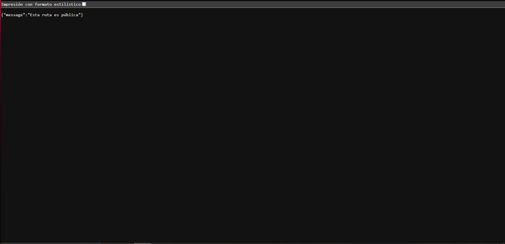
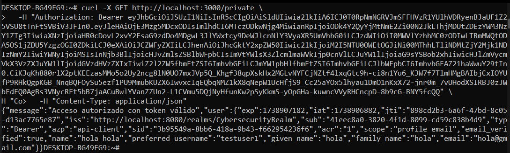
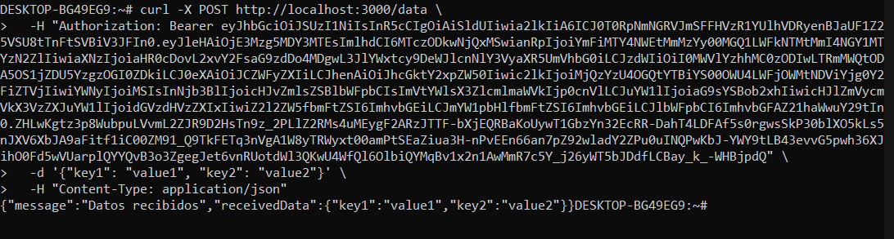

# *Securing an API with OpenID Connect and OAuth using Keycloak*

## *Repository link*

https://github.com/Jskenpo/EJERCICIO-AUTENTICACION-SEGURIDAD

## *Overview*

A RESTful API built with Node.js and Express.js, secured using Keycloak, OIDC, and OAuth 2.0 for authentication and
authorization. Public and protected endpoints are managed via JWT validation.

## *Setup*

### *1. Keycloak Configuration*

Run from the project root: docker-compose up --build

- Keycloak: http://localhost:8080 (Admin: admin/admin)
- API: http://localhost:3000

### *2. API Implementation*

Endpoints:

- *GET /public* → Public access
- *GET /private* → Protected (requires authentication)
- *POST /data* → Protected (requires authentication)

### *3. Authentication & JWT Validation*

- Allow access to /public without authentication
- Require a valid JWT token for /private and /data

## *How to Run?*

1. Initialize Docker and run the following commands:

```bash
docker-compose up --build
```

This will create the Keycloak server and the API server. The client and the users will be created automatically. under
the credentials `test/test`.

2. Now, you can acces the `/public` endpoint without any authentication.
3. To access the `/private` and `/data` endpoints, you need to provide a valid JWT token.
    1. Run `curl -X GET "http://localhost:8080/realms/CybersecurityRealm/protocol/openid-connect/certs` and get the `n`
       and `e` values. Insert them in the `verifyToken.js` file.
    2. Get your acces token by running the following command:
   ```bash
   curl -X POST "http://localhost:8080/realms/CybersecurityRealm/protocol/openid-connect/token" \
     -H "Content-Type: application/x-www-form-urlencoded" \
     -d "client_id=api-client" \
     -d "client_secret=mysecret" \
     -d "username=test" \
     -d "password=test" \
     -d "grant_type=password"
    ```
    3. Copy the access token and paste it to acces the `/private` endpoint:
    ```bash
   curl -X GET "http://localhost:3000/private" \
     -H "Authorization: Bearer <token>"
    ```
    4. Copy the access token and paste it to acces the `/data` endpoint:
    ```bash
    curl -X POST "http://localhost:3000/data" \
     -H "Authorization: Bearer <token>" \
     -H "Content-Type: application/json" \
     -d '{"key": "value"}'
   ```

## *Public*

<p align="center">
  <br>
  
  <br>
</p>

## *Private*

<p align="center">
  <br>
  
  <br>
</p>

## *Data*

<p align="center">
  <br>
  
  <br>
</p>